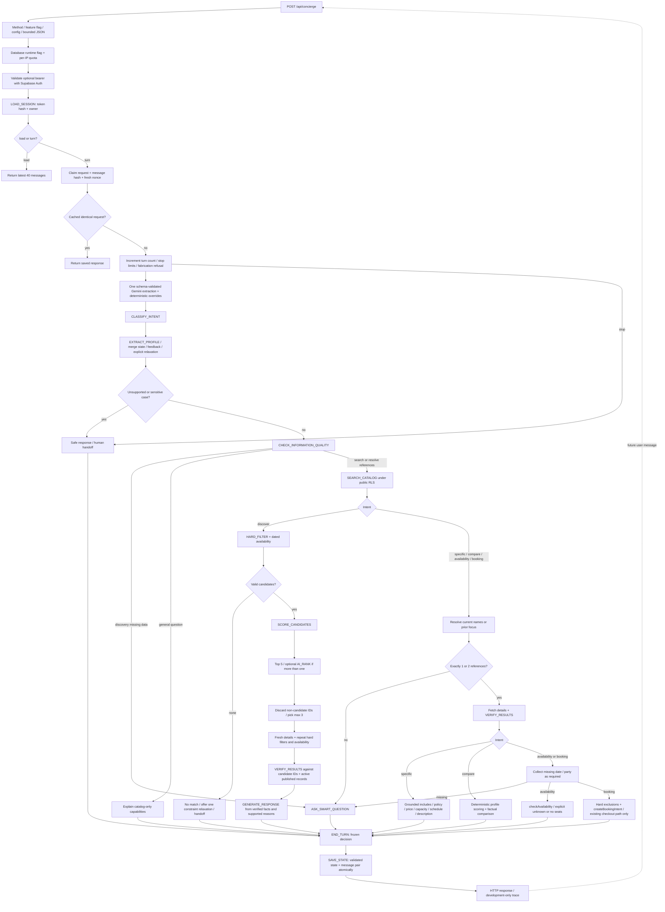

# Actual Akiles Concierge graph

Matches `handler.ts`, `orchestrator.ts`, `profile.ts`, `clarification.ts`, `scoring.ts`, `catalog.ts`, `model.ts`, `voice.ts` and `persistence.ts` after the f0cb390 review. This is one sequential orchestrator; no LangGraph, autonomous subagents, recursive agent loop or free-form final LLM answer.

Errors at gates/auth/persistence return non-200 and no fabricated recommendation. Errors inside the orchestrator produce a safe handoff, then attempt to save it. Save failure returns non-200; client keeps the same request ID for retry. SQL claim conflict is 409; quota 429; inaccessible session 403. Gateway unavailable/disabled is 503. No uncontrolled retry edge exists.

## Nodes and state mutations

| Node | Actual behavior / state |
| --- | --- |
| Load/claim | DB owns conversationId/userId; validates persisted schema or initializes safe defaults. Recent messages returned for UI; model receives profile + last question, not raw entire chat history. Claim returns a lease nonce and version. |
| Extraction | One structured call returns intent, profile patch, references, feedback, topic and question proposal. Deterministic extraction overrides recognized concrete facts/intents. Trace separates CLASSIFY_INTENT and EXTRACT_PROFILE even though one model request supplies both. |
| Profile merge | Preserve known values; update changed fields; merge avoidance; explicit consent relaxes only pending constraint; reject current first recommendation; keep a pending route while answering its missing information. |
| Information quality | Deterministic decision from state. At most one question from a fixed Spanish bank. Known fields are not requested. Model question proposal does not control arbitrary text. |
| Catalog/search | Paginated published/active public-RLS records; approved provider where linked. Reads at most 5,000 rows; exceeding limit fails safely. Filters argument currently does not produce SQL preferences: hard rules run deterministically after the broad public query. |
| Hard filters | Active/publication/provider, group capacity, reviewed child/physical/transport restrictions, price/currency, ticket inventory, locations/interests/avoidance. Dated search invokes availability. State records candidates/exclusion reasons. |
| Scoring | Configurable weights: interests .30, feelings .20, adventure .10, group .10, pace .10, budget .10, location .10. Normalize over known dimensions only; explanations are supported dimension names, not hidden reasoning. |
| AI rank | Send top five score/metadata records plus profile. Schema accepts IDs/reason codes only; whitelist returned IDs. Invalid/missing response falls back to deterministic first two. Maximum final three. |
| Verification | Fetch chosen records again, repeat hard filters (and availability if dated), intersect with pipeline IDs, published/active state and provider eligibility. Build cards/voice only from surviving records. Store final recommended IDs/confidence; clear previous focus/question/relaxation. |
| No match | Clear recommendation IDs; increment refinement counter; suggest relaxing one constraint only if it is the sole exclusion on a candidate. Otherwise ask a generic refinement question. Unknown availability or loop limit hands off; never inserts unrelated alternatives. |
| Specific | Resolve from catalog/name or current mentioned focus; fetch and verify. Return raw stored inclusions, policy, price, capacity, recurring-time facts or description. No discovery ranking. Still uses one catalog read to resolve names. |
| Compare | Exactly two fetched, verified records; deterministic profile scores, grounded prices/locations and supported reason; no Gemini rerank. Ask when ambiguous. |
| Availability | Remember focused record before asking for date/party. Return available/unavailable/unknown only from tool result. Registered schedule is not an availability promise. |
| Booking | Preserve hard constraints. Existing `/e/<id>` navigation intent only. Known date requires verified availability; unknown date is collected by checkout. No booking insert/payment. |
| Save | Handler persists every completed decision via v2 finish. `END_TURN` trace entry is the end of reasoning before SAVE_STATE; response only sent after save succeeds. Cached replay skips reasoning/save. |

## Tool implementation

- `searchExperiences`: public catalog, nested provider metadata, schedules, slots, tiers.
- `getExperienceDetails`: fresh exact UUID, published/active + provider guard.
- `getExperiencePrice` / `getExperiencePolicies`: wrappers over details; direct Q&A currently reuses its already-fetched record instead of calling these wrappers again.
- `checkAvailability`: date/party validation; date overrides recurring schedule; El Salvador UTC-6, registration cutoff, requested time window, applicable tier inventory, `slot_booked_seats`, `min(slot capacity, activity max) - booked`. No schedule means no bookable departure; tool error means unknown. Snapshot only, no hold.
- `createBookingIntent`: fresh details, party validation, optional date/time availability, then constrained existing path. Never creates a DB booking.
- Persistence tools (`gate/load/claim/finish_v2`): server-only service transport; catalog/model never use privileged transport.

## Loops and stopping

One user message runs one bounded turn. Next message explicitly re-enters load; no internal conversational recursion. Maximum three clarification questions, five refinement/no-match loops, 1,000 persisted turns/session; 30 API requests/minute/IP across tokens. One network retry (two attempts maximum); model output retries once with no stacked transport retry. Shared tool deadline 65s, 90s lease/client timeout; safe save has separate bounded attempts. A repeated identical question stops/hands off instead of looping.

Stop after clarification, general answer, recommendation, grounded Q&A, comparison, availability result, booking navigation intent, fabrication refusal, no safe action or human handoff. Corporate/large groups, accessibility, payment/refund/safety ambiguity and unsupported constraints hand off; no claim that a human was automatically contacted.

## Trace access

Local development AND `CONCIERGE_DEBUG=true` return message, before/after state, extracted changes, node decisions, tool names, exclusions/candidates, scores, model rank IDs, invalid IDs, verification and final IDs. Expand the chat's development trace panel. It contains no chain-of-thought, model rationale or prompt text. Vercel production/Preview adapters hard-code development=false; only safe summary logs can be enabled there. Browser requests cannot elevate this flag.
